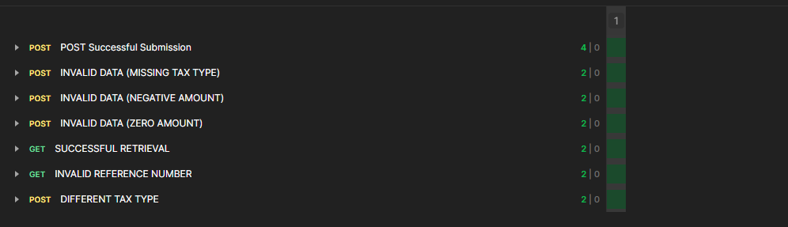
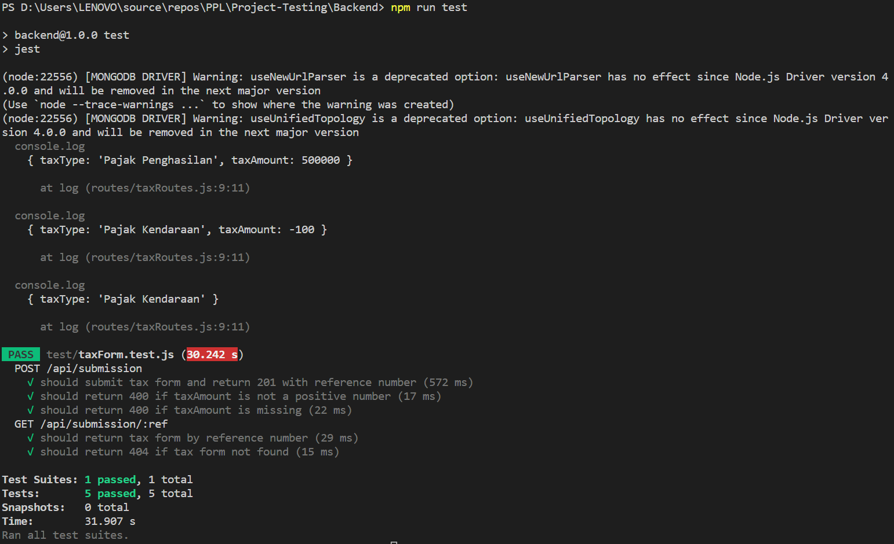
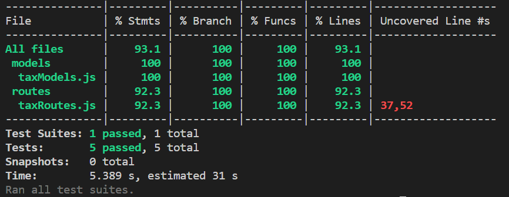

# Tugas Akhir Pengujian Perangkat Lunak: Pengujian Sistem Web-App Sistem Pembayaran Pajak

**Roles:**

- Anggito Muhammad A. (498140) --> Front-end Developer dan White Box Tester
- Hezekiel Sitepu (498213) --> Black Box Tester
- Nasywa Rahmadhani P.S (498375) --> Back-end Developer dan White Box Tester

**Link PPT**

- https://docs.google.com/presentation/d/1A7DJPvBtW0DoJxY6T0Mhp48TZzW-EfgSVlCR04ymahk/edit?usp=sharing

---

## 📋 User Requirements

| **No** | **User Requirement**           | **Deskripsi**                                                                                                                       |
| ------ | ------------------------------ | ----------------------------------------------------------------------------------------------------------------------------------- |
| UR1    | Pengajuan Pajak Online         | Pengguna dapat melakukan pengajuan pajak melalui aplikasi                                                                           |
| UR2    | Pemilihan Jenis Pajak          | Pengguna dapat memilih jenis pajak dari daftar dropdown                                                                             |
| UR3    | Input dan Validasi Data Pajak  | Pengguna wajib mengisi jenis pajak dan jumlah pajak. Sistem akan menolak jika data tidak lengkap atau jumlah pajak bernilai negatif |
| UR4    | Nomor Referensi Pajak Otomatis | Setelah berhasil mengajukan, sistem menghasilkan nomor referensi pajak secara otomatis (misal: TAX2025-12)                          |
| UR5    | Cetak Bukti Pengajuan          | Setelah mengajukan pajak, pengguna dapat mencetak bukti pengajuan                                                                   |
| UR6    | Tampilan Detail Pengajuan      | Setelah pengajuan berhasil, pengguna dialihkan ke halaman yang menampilkan detail data pajak dan nomor referensi                    |
| UR7    | Melakukan Cek Status Pengajuan | Setelah mendapatkan nomor referensi, pengguna dapat melakukan pengecekan status                                                     |
| UR8    | Validasi Nomor Referensi       | Jika nomor referensi tidak ditemukan saat pengecekan status, sistem akan menampilkan pesan kesalahan yang sesuai                    |
| UR9    | Penyimpanan Data Aman          | Data pengajuan pengguna harus tersimpan di database agar tidak hilang saat halaman di-refresh atau ditutup                          |

---

## ✍ Feature Analysis

| **Fitur**                  | **Deskripsi**                                                                                  | **Terkait User Requirement** |
| -------------------------- | ---------------------------------------------------------------------------------------------- | ---------------------------- |
| Halaman Formulir Pajak     | Halaman utama yang berisi formulir pengajuan pajak                                             | UR1                          |
| Dropdown Jenis Pajak       | Dropdown berisi pilihan jenis pajak seperti Pajak Penghasilan dan Pajak Kendaraan              | UR2                          |
| Input Jumlah Pajak         | Kolom angka untuk mengisi jumlah pajak yang akan diajukan                                      | UR3                          |
| Validasi Formulir          | Sistem menolak jika ada input kosong atau jumlah negatif                                       | UR3                          |
| Tombol “Ajukan Pembayaran” | Menyimpan data dan memicu proses pembuatan nomor referensi otomatis                            | UR4                          |
| Halaman Konfirmasi Pajak   | Menampilkan ringkasan data pengajuan dan nomor referensi setelah pengajuan berhasil            | UR6                          |
| Tombol “Cetak Bukti”       | Menghasilkan bukti PDF pengajuan yang bisa diunduh atau dicetak                                | UR5                          |
| Halaman Cek Status         | Memungkinkan pengguna mencari status pengajuan berdasarkan nomor referensi                     | UR7                          |
| Validasi Nomor Referensi   | Sistem memverifikasi apakah nomor referensi valid saat pengecekan                              | UR8                          |
| Database Persisten         | Sistem menggunakan database agar data tetap tersimpan meskipun halaman di-refresh atau ditutup | UR9                          |

---

## 📝 End-to-End Testing (Acceptance Test)

| **No** | **Test Case**                    | **Langkah**                                                                                                                      | **Expected Result**                                                                                      | **Terkait**             |
| ------ | -------------------------------- | -------------------------------------------------------------------------------------------------------------------------------- | -------------------------------------------------------------------------------------------------------- | ----------------------- |
| TC1    | Berhasil ajukan pajak            | 1. Buka halaman pengajuan pajak<br>2. Pilih jenis pajak<br>3. Isi jumlah pajak 1.000.000<br>4. Klik "Ajukan Pembayaran"          | Muncul halaman detail pengajuan dengan nomor referensi (misal TAX2025-12) dan data pajak yang dimasukkan | UR1, UR2, UR3, UR4, UR5 |
| TC2    | Validasi jika jenis pajak kosong | 1. Buka halaman pengajuan pajak<br>2. Tidak memilih jenis pajak<br>3. Isi jumlah pajak 1.000.000<br>4. Klik "Ajukan Pembayaran"  | Muncul error: “Jenis pajak harus dipilih”                                                                | UR3                     |
| TC3    | Validasi jika jumlah negatif     | 1. Buka halaman pengajuan pajak<br>2. Tidak memilih jenis pajak<br>3. Isi jumlah pajak -1.000.000<br>4. Klik "Ajukan Pembayaran" | Muncul error: “Jumlah pajak harus angka positif”                                                         | UR3                     |
| TC4    | Nomor referensi unik otomatis    | 1. Melakukan pengajuan pajak 2 kali<br>2. Mencatat nomor referensi                                                               | Nomor referensi berbeda (misal TAX2025-12 dan TAX2025-13)                                                | UR4, UR7                |
| TC5    | Cetak bukti pengajuan berhasil   | 1. Melakukan pengajuan pajak<br>2. Klik "Cetak Bukti"                                                                            | Sistem menghasilkan file PDF yang bisa diunduh/dicetak                                                   | UR6                     |
| TC6    | Cek status berhasil              | 1. Melakukan pengajuan pajak<br>2. Buka halaman cek status<br>3. Masukkan nomor referensi<br>4. Klik "Cek Status"                | Sistem menampilkan detail pengajuan pajak sesuai referensi                                               | UR7                     |
| TC7    | Nomor referensi tidak ditemukan  | 1. Buka halaman cek status<br>2. Masukkan nomor acak yang tidak valid (misal XYZ999)<br>3. Klik "Cek Status"                     | Muncul error : “Nomor referensi tidak valid atau data pengajuan tidak ditemukan”                         | UR8                     |
| TC8    | Data bertahan setelah refresh    | 1. Melakukan pengajuan pajak<br>2. Refresh pada halaman detail pajak yang diajukan                                               | Informasi detail pajak yang diajukan masih tampil                                                        | UR9                     |
| TC9    | Simpanan database setelah submit | 1. Melakukan pengajuan pajak<br>2. Refresh halaman atau keluar dari aplikasi<br>3. Cek data di cek status                        | Informasi detail pajak yang diajukan masih tampil                                                        | UR9                     |

---

## API Test



API Test Result for All Endpoint

---

## Coverage Test


Unit Test Frontend


Coverage Test untuk Frontend


Unit Test Backend


Coverage Test Backend


For run Test, create babel.config.js:
```
module.exports = {
presets: [
["@babel/preset-env", { targets: { node: "current" } }],
"@babel/preset-react",
"@babel/preset-typescript",
],
};
```
